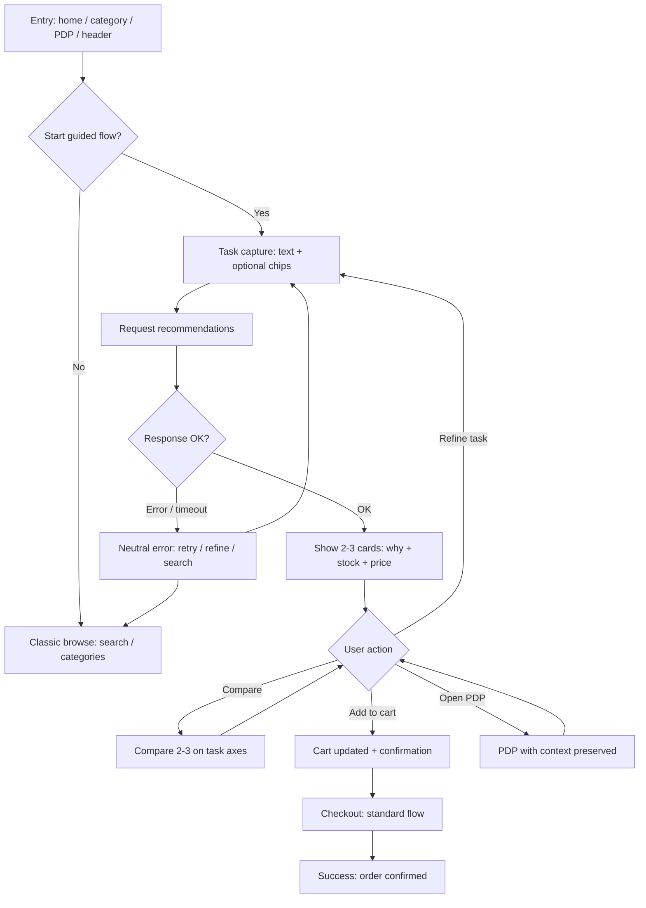
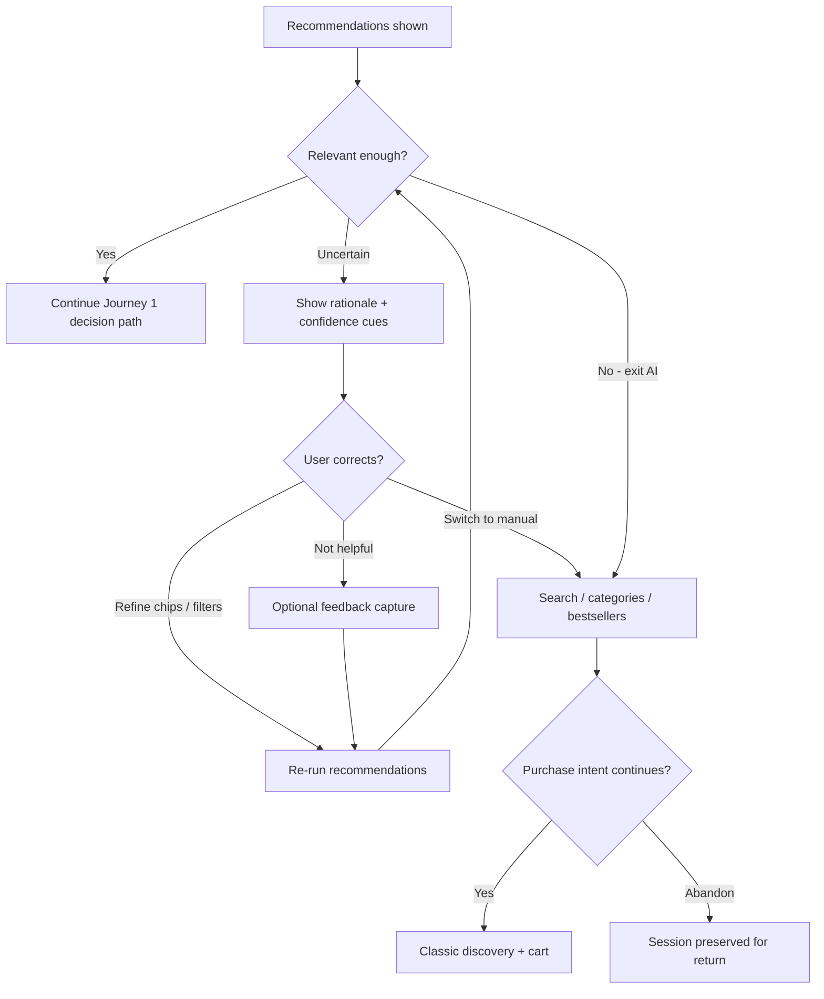
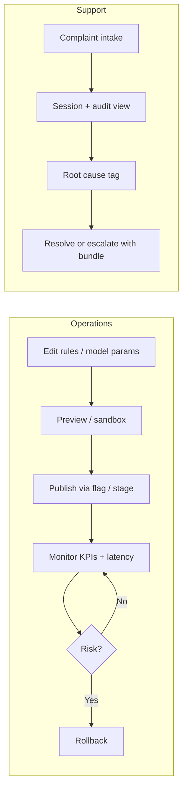

---
stepsCompleted:
  - 1
  - 2
  - 3
  - 4
  - 5
  - 6
  - 7
  - 8
  - 9
  - 10
  - 11
  - 12
  - 13
  - 14
lastStep: 14
inputDocuments:
  - _bmad-output/planning-artifacts/prd.md
---

# UX Design Specification practice-software-testing

**Author:** Rudolfgroetz
**Date:** 2026-04-19

---

<!-- UX design content will be appended sequentially through collaborative workflow steps -->

## Executive Summary

### Project Vision

practice-software-testing is an existing tool webshop evolving into an AI-guided buying experience. The UX vision is to help craftsmen move from task intent to confident product choice with minimal friction, while preserving trust through clear recommendation explanations and seamless fallback paths.

### Target Users

Primary users are craftsmen (carpenters, electricians, plumbers) who know the job to be done but not always the exact product needed. Secondary users include operations and admin users who tune recommendation behavior and run experiments, support users who investigate recommendation complaints, and integration users consuming recommendation and telemetry APIs.

### Key Design Challenges

- Building trust calibration for AI suggestions through transparent "why this fits" guidance.
- Supporting fast decisions under uncertainty while minimizing cognitive load.
- Making recovery from weak recommendations seamless through equivalent manual fallback paths.
- Balancing proactive guidance with user autonomy and control.
- Keeping shopper, operations, and support experiences aligned around recommendation meaning and diagnostics.

### Design Opportunities

- Introduce a task-first onboarding pattern that starts from user intent rather than product search keywords.
- Use explainability microcopy as a conversion and trust differentiator.
- Provide confidence-oriented comparison of a few high-fit options instead of broad, noisy product grids.
- Use progressive assistance that increases support only when user uncertainty signals are detected.
- Position fallback navigation as a first-class path rather than a degraded mode.

## Core User Experience

### Defining Experience

The defining interaction is **confidently choosing the right product in one smooth flow** guided by AI—not open-ended browsing or manual search. Success is the moment the user thinks “this is exactly what I need” and commits (selects or adds to cart) without leaving the guided path.

### Platform Strategy

**Hybrid web (SPA + SSR)** is the UX baseline:

- **SSR** for fast, indexable entry (home, category, product) so users land with context and performance.
- **SPA** for fluid, app-like behavior during **task description → recommendations → comparison → decision**, so the experience feels like a smart assistant, not a page-reload catalog.

### Effortless Interactions

These should require almost no cognitive effort:

- **Describing the task** (job-to-be-done), not naming a product.
- **Understanding why** each of a few options is recommended (plain-language rationale).
- **Comparing 2–3** relevant options only—not dozens.
- **Deciding once** without second-guessing or tab-hopping.

If users must grind through many items, puzzle over opaque suggestions, or leave the site to validate choices, **UX has failed**.

### Critical Success Moments

| Moment | Why it matters |
|--------|----------------|
| **First recommendation set** | If the first 2–3 picks feel irrelevant, trust collapses immediately. |
| **Explanation clarity** | If “why this” is unclear, users will not trust AI and will revert to search/filter. |
| **Decision speed** | If guided flow feels slower than search/filter, users abandon the assistant. |
| **Fallback** | If users feel trapped by AI, frustration spikes; fallback must feel **equal**, not broken. |
| **Performance** | Delays beyond ~**500 ms** break the “smart assistant” illusion and erode confidence. |

### Experience Principles

1. **Task-first, not catalog-first** — Start from what the user is trying to do; product names are optional.
2. **Few, sharp choices** — Default to **2–3** high-fit options with clear tradeoffs, not infinite scroll.
3. **Explainability as trust** — Every strong recommendation earns its place with a concise “why this fits your task.”
4. **Speed beats clever** — The guided path must feel **faster and easier** than search/filter, or it loses.
5. **Graceful parity** — Search, categories, and bestsellers are **first-class** escape hatches, not punishment for AI failure.
6. **Assistant illusion depends on responsiveness** — Sub-500 ms interactions preserve the feeling of intelligence.

## Desired Emotional Response

### Primary Emotional Goals

- **Confident and decisive** — Users should feel they can commit without second-guessing or leaving to “check elsewhere.”
- **In control, not led** — Guidance should feel like a skilled colleague, not a pushy salesperson or a black box.
- **Efficient and time-respected** — The flow should feel faster and lighter than grinding through search and filters.

Word-of-mouth comes from: *“It got me the right thing without the usual hassle.”*

### Emotional Journey Mapping

| Stage | Desired feeling |
|--------|------------------|
| **First discovery / first AI use** | Curious and hopeful; low fear of “doing it wrong.” |
| **Task → recommendations → compare** | Focused calm; rising trust as explanations match their reality. |
| **Decision (select / add to cart)** | Decisive relief — “yes, this is it.” |
| **After success** | Accomplished and time-saved; willing to use AI again next visit. |
| **When recommendations miss** | Still respected and in control — clear recovery, no blame, no dead end. |
| **Return visit** | Familiar trust; optional shortcuts for repeat tasks. |

### Micro-Emotions

**Prioritize**

- **Confidence over confusion** — Few options, plain language, visible tradeoffs.
- **Trust over skepticism** — Explicit “why this,” source of signal (rules vs AI), honest limits.
- **Calm focus over anxiety** — No countdown pressure, no dark patterns, no overload.

**Avoid**

- **Confusion** from jargon, unexplained rankings, or hidden criteria.
- **Skepticism** from generic picks, “creepy” over-personalization, or consent-dark patterns.
- **Anxiety** from irreversible-feeling choices, slow responses, or trapped-in-chat UX.
- **Frustration** from opaque errors, missing fallback, or having to fight the assistant.

### Design Implications

| Desired feeling | UX direction |
|-----------------|--------------|
| Confident | 2–3 strong picks, comparison on task-relevant axes, clear primary action. |
| In control | Obvious exit to search/categories; user can steer context and say “not this.” |
| Trusting | Short “why this” copy; optional detail on demand; disclose AI vs rule-based where it matters. |
| Calm | Progressive disclosure; avoid dense spec walls before the user asks. |
| Respected on failure | Neutral tone, “try this instead,” no user-blaming microcopy. |

### Emotional Design Principles

1. **Clarity before cleverness** — Emotional safety comes from understanding, not from surprise UI.
2. **Earn trust every session** — First recommendations and explanations carry disproportionate weight.
3. **Speed is an emotion** — Responsiveness under ~500 ms supports “this thing is smart,” not just performance metrics.
4. **Dignified fallback** — Manual paths should feel like a choice, not a demotion.
5. **No emotional debt** — Avoid patterns that make users feel watched, rushed, or foolish; align with consent-first analytics and privacy posture from the PRD.

*Note: This section was aligned to the PRD and Core User Experience after you chose to continue without separate emotional bullet answers.*

## UX Pattern Analysis & Inspiration

### Inspiring Products Analysis

Stakeholders did not name specific “favorite apps” for this pass. Analysis therefore uses **recurring UX pattern families** from products many craftsmen already use in daily life—without claiming those products as formal references.

| Pattern family | What tends to work well | Relevance to this shop |
|----------------|-------------------------|-------------------------|
| **High-trust transactional flows** (e.g. banking, payments) | Clear states, explicit consent, plain language, obvious next step | Maps to consent-gated analytics, checkout-adjacent calm, and “no surprises” copy |
| **Goal-first navigation** (e.g. maps, ride/delivery apps) | Start from intent (“where to?”), offer a few strong routes, easy replan | Maps to task-first AI: describe job → few recommendations → easy “not this / refine” |
| **Mature e-commerce** | Strong search, filters, PDP depth, compare | Maps to **fallback parity**—users must never feel the classic shop was removed |
| **Conversational assistants** | Thread context, short turns, optional streaming, escape hatch | Maps to chat-like guidance without trapping the user in a modal dead-end |

### Transferable UX Patterns

**Navigation and hierarchy**

- **Intent entry first** — One prominent “What are you trying to do?” path beside (not replacing) search.
- **Branching recovery** — “Refine task,” “Show more like #2,” and “Use search instead” as peers.

**Interaction**

- **Small-set compare** — Lock comparison to 2–3 items with task-relevant attributes surfaced first.
- **Explain-on-card, detail-on-demand** — One-line rationale visible; full reasoning expandable.
- **Performance-as-UX** — Skeleton or optimistic UI for recommendation slots so layout does not jump.

**Trust and compliance-adjacent UX**

- **Consent-before-measurement** — Analytics and personalization hooks visually inactive until CMP allows.
- **Source disclosure** — Subtle label when a pick is rule-based vs model-based (per FR11).

**Visual**

- **High-contrast actions** — One primary button per decision step (e.g. “Add best match” vs competing CTAs).
- **Calm density** — Tool shoppers expect data; use tabs/accordion for specs, not walls above the fold.

### Anti-Patterns to Avoid

- **Infinite or noisy grids** as the default AI outcome — undermines “2–3 sharp picks” and erodes trust.
- **Opaque “Recommended for you”** with no verifiable reason — triggers skepticism and site exits.
- **Chat traps** — Full-screen chat with no persistent link to search, category, or cart.
- **False urgency** — Fake stock timers or manipulative scarcity for AI-led paths.
- **Surveillance vibes** — Over-personalized copy that implies data the user did not knowingly share.
- **Slow “intelligence”** — Empty states or long spinners on first recommendations break the assistant illusion.

### Design Inspiration Strategy

**Adopt**

- Goal-first routing and **few-option compare** from navigation and assistant pattern families.
- **Plain-language explanations** and progressive disclosure from high-trust transactional patterns.
- **Consent-gated instrumentation** patterns aligned with the PRD’s CMP and analytics rules.

**Adapt**

- E-commerce search/filter PDP depth remains **first-class**—borrow layout familiarity but **do not** copy endless-scroll discovery as the AI default.
- Assistant-style chat: use **docked or split** patterns so product context (cart, stock) stays visible.

**Avoid**

- Any pattern that prioritizes engagement over **decision quality** (noise, dark patterns).
- Black-box ranking, chat-only purchase flows, or hiding manual escape routes.

*Note: “Defaults” inspiration pass—no specific third-party apps were named by stakeholders; refine this section later if you add concrete references.*

## Design System Foundation

### 1.1 Design System Choice

**Bootstrap 5** is the primary design system for the storefront and AI-augmented commerce UI, aligned with the brownfield stack described in the PRD (Angular + Bootstrap). **Custom components and layout patterns** cover AI-specific surfaces (task capture, explanation cards, compact compare, consent-aware instrumentation). **Angular CDK** may be used selectively for accessible overlays, focus management, and list/virtual-scroll behaviors without adopting a second full visual language (e.g. full Material Design) unless the team explicitly chooses that later.

### Rationale for Selection

- **Matches existing product** — Faster delivery, fewer regressions, and one coherent visual language for shoppers.
- **Fits dense commerce** — Forms, tables, alerts, and grids are first-class in Bootstrap-class patterns; tool retail needs scannable structure.
- **MVP-friendly** — Theme tokens + a small set of custom components beat “new design system from scratch” for validation speed.
- **Avoids split-brain UI** — Introducing a large second system alongside Bootstrap risks inconsistent spacing, focus rings, and density unless heavily bridged.

### Implementation Approach

- Use **Bootstrap utilities and components** as the default for layout, typography, buttons, forms, modals, and navigation chrome.
- Define **AI module patterns** as documented extensions: e.g. “Recommendation strip,” “Explain popover,” “Task prompt bar,” “Compare drawer,” each with specified spacing, heading levels, and primary/secondary actions.
- Apply **design tokens** (CSS variables or SCSS maps) for brand color, radius, and elevation so Bootstrap defaults can be tuned without fork drift.
- Use **Angular CDK** where it reduces risk: focus trap in assistant panel, a11y listbox patterns for keyboard-first recommendation picking, overlay positioning.

### Customization Strategy

- **Brand layer** — Map brand primary/secondary/neutral to Bootstrap theme variables; limit one accent for “AI-assisted” highlights so the assistant feels distinct but not a different product.
- **Density** — Slightly tighter vertical rhythm on listing and compare rows than marketing pages; keep touch targets at or above WCAG minimums on mobile.
- **Component ownership** — Document which pieces are “Bootstrap-native” vs “project-owned” so designers and devs do not duplicate patterns.
- **Future option** — If the org later standardizes on another system, plan a **strangler** migration (replace module-by-module) rather than a big-bang re-skin.

*Design system choice confirmed via stakeholder “continue” (`c`) defaulting to the recommended Bootstrap-first path.*

## 2. Core User Experience

### 2.1 Defining Experience

**One-line promise:** Describe the job → get **2–3** strong, explained picks → commit (select / add to cart) **without** defaulting to search-and-scroll.

**How users describe it to a friend:** *“I said what I was doing; it showed me the right tools and told me why—not a wall of random stuff.”*

### 2.2 User Mental Model

- **Today:** “Webshop = search, filters, open ten tabs, guess.”
- **Here:** “**Assistant for the task**, shop for the edge cases”—same catalog, different **default entry** when intent is fuzzy.
- **Expectations:** Stock and price truth, honest limits (“we’re not sure—pick from these”), and **escape** to classic browse **without** losing context.

### 2.3 Success Criteria

- User reaches a **confident primary choice** in line with PRD time-to-decision goals.
- **First recommendation set** feels relevant; explanations read as **grounded**, not marketing fluff.
- Guided path feels **faster or easier** than DIY search for the same outcome.
- **Fallback** is one obvious action away; no trap, no shame copy.
- **Responsiveness** preserves the “smart assistant” feel (sub-~500 ms perceived for recommendation steps).

### 2.4 Novel UX Patterns

- **Novel in emphasis, not in atoms:** familiar **chat / side panel + product cards + compare + cart**, combined as a **task-first default** on top of a normal store.
- **Teaching strategy:** starter prompts, example tasks, and “refine with one tap” chips—not a blank chat void.

### 2.5 Experience Mechanics

1. **Initiation** — Entry from home, category, PDP, or header: **“Help me choose”** / “Start with my task.”
2. **Interaction** — User states the task (optional chips: material, environment, budget band). System returns **2–3** cards with **one-line “why”**, key specs, stock/price, and a clear primary action.
3. **Feedback** — Loading uses **stable skeletons**; errors are neutral with **retry / refine / use search** paths.
4. **Completion** — **Add to cart** (primary), **Compare** (secondary), **Not quite** (refine or swap pick).
5. **Next** — Optional “Continue shopping” or jump to checkout; session keeps **attribution** for analytics.

*This extends the earlier `## Core User Experience` section with mechanics and success detail rather than replacing it.*

## Visual Design Foundation

### Color System

- **No formal brand guidelines were provided** (`c` = proceed with defaults). Semantic mapping targets **Bootstrap 5 theme variables** (`--bs-primary`, `--bs-secondary`, `--bs-body-color`, `--bs-border-color`, `--bs-success`, `--bs-warning`, `--bs-danger`, `--bs-info`).
- **Primary:** deep, trustworthy blue-neutral (high contrast on white); use for primary actions and key links.
- **Secondary / surface:** cool neutrals for chrome, cards, and dividers—supports “calm focus” from emotional goals.
- **AI accent:** one restrained hue (e.g. teal or indigo) **only** for assistant affordances (task bar, “why this” badges, active assistant state)—must not compete with primary cart/checkout red or green semantics already in Bootstrap.
- **Semantic:** keep success/warning/danger for stock, errors, and destructive actions; never repurpose for decoration.
- **Contrast:** meet **WCAG 2.1 AA** for text and interactive states; validate focus rings (`:focus-visible`) against background.

### Typography System

- **Stack:** system UI stack or project webfont if brand supplies later—default to readable sans (Bootstrap’s stack) for speed.
- **Tone:** professional, direct, slightly industrial—avoid playful display faces for core commerce.
- **Scale:** Bootstrap type scale for `h1–h6` and body; **tighten** line-height slightly on dense listing/compare rows only where AA still passes.
- **Hierarchy:** task prompt and product titles dominate; “why this” copy one step smaller than product title, never smaller than minimum body for long reads.
- **Numerals:** tabular lining figures for prices and specs in compare tables.

### Spacing & Layout Foundation

- **Base unit:** **8px** mental model (Bootstrap spacing scale aligns: 0.25rem steps).
- **Density:** **efficient** on listing, compare, and PDP spec zones; **airier** on marketing/landing SSR pages.
- **Grid:** 12-column fluid grid for storefront; AI assistant uses **split layout** (content + assistant column) from `md` breakpoint up; stacked single column on small screens.
- **Component rhythm:** consistent padding inside cards (`p-3` / `p-4` tokens); align recommendation cards to the same height baseline where possible to reduce scan jitter.

### Accessibility Considerations

- **WCAG 2.1 AA** for color contrast, focus order, labels, and error identification (per PRD).
- **Keyboard:** full path through task → recommendations → compare → add to cart; visible focus at all times.
- **Screen readers:** expose list semantics for recommendation sets; “why this” content associated via `aria-describedby` or expandable regions with proper `aria-expanded`.
- **Motion:** respect `prefers-reduced-motion`; do not animate layout shifts on recommendation load.
- **Consent:** CMP banner/first-layer UI must not trap focus before user acts (modal gating rules).

*Visual foundation established without external brand PDF—revisit when brand tokens are supplied.*

## Design Direction Decision

### Design Directions Explored

Four directions are implemented as static mock blocks in:

`_bmad-output/planning-artifacts/ux-design-directions.html`

1. **Workbench contrast** — high-clarity catalog + restrained AI accent.  
2. **Soft industrial** — warmer neutrals, softer shadows, approachable copy blocks.  
3. **Compact pro** — maximum density for repeat buyers; smaller vertical rhythm.  
4. **Night bench** — dark chrome variant for low-glare workshop browsing (optional segment).

### Chosen Direction

**Provisional:** **Direction 1 — Workbench contrast**, pending stakeholder review of the HTML showcase. Stakeholder advanced the workflow with `c` without naming a preferred variant.

### Design Rationale

- Best matches **trust, clarity, and speed** emotional goals and the PRD’s dense-commerce + assistant emphasis.
- Keeps Bootstrap defaults recognizable while allowing a **single AI accent** channel.
- Lowest risk for **WCAG** validation on default light surfaces.

### Implementation Approach

- Implement Direction 1 as the **default Bootstrap theme override** (CSS variables).
- Keep Direction 3 (Compact pro) as a **user or role preference** later if tradespeople want density.
- Treat Direction 4 (Night bench) as a **phase-2** theme flag after core flows stabilize.

*Re-open this decision after reviewing `ux-design-directions.html` and swap the Chosen Direction section if another variant wins.*

## User Journey Flows

Flows build on **User Journeys** in the PRD (`_bmad-output/planning-artifacts/prd.md`). Shopper paths are fully diagrammed; internal journeys are summarized with the same decision and recovery discipline.

### Journey 1: Primary user — guided purchase (success)

**Goal:** From task intent to cart with **2–3** explained picks, minimal tab churn, inventory-aware confidence.

**Entry:** Home hero “Help me choose,” category contextual entry, header affordance, or PDP “Find for my task.”

**Flow design:** User states task (free text + optional chips: material, environment, budget band). System returns a **short ranked set** with one-line “recommended because,” stock/price, and primary **Add to cart** / secondary **Compare** / **Refine**. Compare locks to task-relevant attributes. Success = confident add or select with checkout handoff preserving session attribution.

**Friction guards:** Skeleton placeholders for recommendation slots; neutral retry on latency; no trap—search/categories remain visible.

### Journey 2: Primary user — low trust / poor initial match (recovery)

**Goal:** Restore trust or **exit with dignity** to manual discovery; capture “Not helpful?” without blame.

**Triggers:** Cold start, vague task, model mismatch, or user mental model ≠ ranking.

**Flow design:** Keep rationale visible; offer **fast correction** (chips, filters, “not this job”). If still weak: **one-click** switch to search/category/bestsellers **without** clearing cart or session. Optional lightweight feedback. Success = purchase completed **or** user leaves having felt in control.

### Journey 3: Internal users — operations, support, and API consumption

**Operations (PRD Journey 3):** Configure rules/boosts/exclusions → preview impact → ship behind **feature flag** or staged % → monitor KPIs and latency → rollback if guardrails breach. Critical moment = **safe publish**, not maximum aggressiveness.

**Support (PRD Journey 4):** Open case → load **session + recommendation trace** (inputs, outputs, scores/explanations if exposed internally) → categorize root cause (data / rules / model) → user-facing workaround or compensation narrative → if systemic, **escalate with evidence** to product/data and log for tuning.

**API (PRD Journey 5):** Authenticated client calls recommendation API with context → renders ranked results + explanations → posts impression/click/conversion telemetry → relies on **versioned** contracts, **<500 ms** SLO, observability for failures.

### Journey patterns

**Navigation**

- **Dual rail:** guided task column (or panel) + persistent **classic** nav (search, categories, cart).
- **Soft landing:** SSR pages can deep-link into guided flow with category/task pre-filled.

**Decision**

- **Small fork:** at most **2–3** primary candidates before “show more” or manual path.
- **Explain-before-expand:** one-line “why” on card; detail behind **accordion** or “Why this pick?” control.

**Feedback**

- **Skeleton-first** for AI slots; **inline** stock/price updates at decision points.
- **Recovery triad:** retry (transient), refine (context), escape (manual)—never a dead end.

### Flow optimization principles

- **Steps to value:** shortest path from “I have a job” to **Add to cart** without mandatory PDP unless user chooses depth.
- **Cognitive load:** one primary CTA per step; compare only on attributes that differ **meaningfully** for the stated task.
- **Delight (quiet):** fast response, honest copy, and “you’re back in control” on fallback—not gamification noise.
- **Errors:** no user-blame; always offer **retry**, **refine**, and **search** in that order of prominence by severity.
- **Continuity:** journey ID / session preserved for analytics and support (PRD FR26 alignment) without exposing internals to the shopper.

*Step 10 saved on stakeholder **Continue (`c`)**.*

## Component Strategy

### Design System Components

**From Bootstrap 5 (foundation):** layout (grid, containers), typography, buttons, links, forms and validation, alerts, badges, cards, list groups, modals, dropdowns, navbars and breadcrumbs, pagination, tables, spinners, toasts, collapse/accordion, offcanvas (optional for mobile compare), utilities (spacing, display, flex, gap, borders, shadows).

**From Angular CDK (selective, non-visual):** overlay and focus trap for assistant panel and modals; listbox/combobox patterns for keyboard-first recommendation picking; optional virtual scroll for long manual lists.

**Coverage note:** Standard storefront chrome (header, footer, PLP, PDP, cart, checkout) stays Bootstrap-first so density and accessibility stay predictable.

### Custom Components

#### Task prompt bar

**Purpose:** Single entry for “what are you trying to do?” without replacing search.  
**Usage:** Home, category headers, PDP secondary CTA, persistent header on guided routes.  
**Anatomy:** label + text area or single-line input + contextual chips (material, environment, budget) + submit + “Use search instead.”  
**States:** empty, typing, submitting, success (hand off to recommendation strip), error (inline + retry), disabled when policy blocks submission.  
**Variants:** compact (header) vs expanded (landing).  
**Accessibility:** visible label, `aria-describedby` for hint text, Enter submits, Escape returns focus; header variant must not trap focus.  
**Content guidelines:** short placeholder examples; no faux-personalized copy.  
**Interaction behavior:** optional debounced chip suggestions for task attributes only; submit triggers recommendation request with loading handoff.

#### Recommendation card (short set)

**Purpose:** Present one ranked option with rationale, stock/price, and actions.  
**Usage:** Primary output of guided flow (two or three instances visible).  
**Anatomy:** thumbnail, title, price, stock state, one-line “why,” source hint (rule vs model per PRD), primary **Add to cart**, secondary **Compare** and **Why details**.  
**States:** loading skeleton, ready, out of stock (disabled add + alternate CTA), error row.  
**Variants:** horizontal vs stacked on narrow viewports.  
**Accessibility:** meaningful heading or region; rationale tied via `aria-describedby`; actions have explicit names.  
**Content guidelines:** one-line why is mandatory before marketing adjectives.  
**Interaction behavior:** title or image opens PDP while preserving guided-session context where applicable.

#### Explain panel / accordion

**Purpose:** Progressive disclosure for longer reasoning without cluttering the card.  
**States:** collapsed (default), expanded; optional “technical detail” tier for power users.  
**Accessibility:** `aria-expanded` on trigger; focus moves into panel when opened.

#### Compact compare tray

**Purpose:** Lock two or three SKUs to task-relevant axes instead of full spec walls.  
**Usage:** After user chooses Compare on cards.  
**Anatomy:** sticky tray on desktop; offcanvas or full-width sheet on small screens; table body uses Bootstrap table patterns.  
**States:** one item selected (prompt for second), two to three locked, max reached (disable further compare with short explanation).  
**Accessibility:** scoped table headers; keyboard navigation across cells.  
**Interaction behavior:** closing tray does not empty cart; removing item updates tray live.

#### Feedback chip (“Not helpful?”)

**Purpose:** Lightweight signal on a miss without modal friction.  
**States:** idle, submitted (brief confirmation toast), optional “Tell us more” for free text.  
**Accessibility:** button or toggle group with a clear accessible name.

#### Consent / instrumentation shell

**Purpose:** Ensure analytics and personalization hooks respect CMP before firing behavior that implies tracking.  
**Usage:** Wraps GA4 or internal telemetry for impressions, clicks, conversions on AI surfaces.  
**States:** blocked, partial, full consent—each maps to which events may enqueue or display.

#### Internal: audit / session trace viewer (support)

**Purpose:** Read-only timeline: inputs, recommendations shown, user actions.  
**Implementation:** Bootstrap tables, badges, accordions; no separate visual language.

### Component Implementation Strategy

- **Token-first:** map brand and AI accent to CSS variables over Bootstrap defaults; custom components consume tokens only.  
- **Composition over new primitives:** recommendation card composes card, badge, button group, collapse.  
- **Single owner per pattern:** document in Storybook (or team equivalent) with accessibility and keyboard specs.  
- **Performance:** skeleton slots use stable min-height to limit CLS; lazy-load card imagery.

### Implementation Roadmap

**Phase 1 — Core (MVP guided path):** task prompt bar, recommendation card, explain accordion, error/retry strip, fallback link row.

**Phase 2 — Decision quality:** compact compare tray, feedback chip, skeleton kit for AI regions.

**Phase 3 — Ops and trust at scale:** consent/instrumentation shell; internal experiment and flag UI (Bootstrap); support audit view layout.

**Phase 4 — Enhancements:** optional offcanvas mobile assistant; density preference (Direction 3); dark theme (Direction 4) behind a flag.

*Step 11 saved on stakeholder **Continue (`c`)**.*

## UX Consistency Patterns

Patterns align with **Bootstrap 5**, **Direction 1 (Workbench contrast)**, and journeys in **User Journey Flows**. Goal: predictable hierarchy, calm errors, and parity between guided and classic paths.

### Button Hierarchy

**When to use:** Every screen that asks for a decision (guided flow, PDP, cart, checkout).

**Visual design:** One **primary** per view (`btn-primary`): usually **Add to cart** in discovery; **Continue** / **Place order** in checkout. **Secondary** (`btn-outline-secondary` or `btn-outline-primary`): Compare, Why details, Refine. **Tertiary** (link or `btn-link`): Use search instead, Skip assistant, View full specs. **Destructive** only for cart remove or account deletion (`btn-danger`), never for “dismiss AI.”

**Behavior:** Primary stays visually dominant; disabling primary requires an inline reason (for example out of stock). Avoid two primaries competing (do not pair **Add to cart** with another filled button of equal weight).

**Accessibility:** Focus order follows reading order; primary is reachable without excessive Tab passes; loading state uses `aria-busy` on the submitting control or form.

**Mobile considerations:** Full-width primary on narrow viewports in modals and bottom sheets; sticky cart or checkout bar keeps one obvious commerce action.

**Variants:** Compact rows in compare tray may use `btn-sm` but keep minimum touch target 44×44 px where tap is primary.

### Feedback Patterns

**When to use:** Recommendation load, cart, checkout, consent, and AI errors.

**Visual design:** **Success:** toast or inline `alert-success` for cart add, feedback submitted. **Info:** `alert-info` for neutral hints (for example “Showing rule-based picks”). **Warning:** `alert-warning` for low stock, partial consent. **Error:** `alert-danger` sparingly; prefer inline field errors on task input.

**Behavior:** **Loading:** skeleton cards for AI slots; spinner only for short blocking actions (for example checkout submit). **Empty:** “No matches” offers **Refine**, **Search**, **Browse category**—never a blank panel. **Retry:** transient API failures show retry, refine, and search in that visual order (strongest to weakest).

**Accessibility:** Live regions for toasts (`role="status"`); errors announced (`role="alert"`) without stealing focus unless the user is inside the failing widget.

**Mobile considerations:** Toasts stack and dismiss; avoid modal-on-modal for recoverable errors.

**Variants:** Inline microcopy under task bar versus banner for global outages (banner uses `alert` plus dismiss).

### Form Patterns

**When to use:** Task prompt, checkout, account, admin and support internal forms.

**Visual design:** Bootstrap labels with `form-control` / `form-select`; group chips in `input-group` or a badge row below the field.

**Behavior:** Validate on submit for task bar (avoid nagging while typing); validate on blur for email and phone in checkout. Errors: message plus link to field; preserve user text.

**Accessibility:** Every input has a visible label or `aria-label`; `aria-invalid` and `aria-describedby` point to error text.

**Mobile considerations:** Appropriate `inputmode` and `autocomplete`; avoid hover-only tooltips—use always-visible hint or a tap “?” control.

**Variants:** Task bar may be single-line and expand to textarea on focus (do not collapse while an error is visible).

### Navigation Patterns

**When to use:** Global chrome, entry to guided flow, escape from AI.

**Visual design:** Navbar: logo, **Help me choose**, search, categories, cart. Breadcrumbs on SSR PLP and PDP. Guided flow uses **split** layout from `md` breakpoint up; stacked on small screens with task block above results.

**Behavior:** **Dual rail:** leaving assistant never clears cart; returning to home keeps session. Deep links from category pre-fill task or filters where sensible.

**Accessibility:** Skip link to main content; landmark regions (`header`, `main`, `nav`); current location in nav indicated.

**Mobile considerations:** Hamburger is acceptable if search and cart stay one tap away; offcanvas for deep category tree.

**Variants:** Sticky subheader for “You’re comparing 2 items” when compare tray is open.

### Additional Patterns

#### Modal and overlay

**When to use:** Checkout login, destructive confirm, optional “Tell us more” after feedback.

**Visual design:** Bootstrap modal; focus trap via Angular CDK where needed.

**Behavior:** Dismiss restores focus to trigger; no CMP or cookie wall that traps focus before the user acts.

**Accessibility:** `aria-modal="true"`; Escape closes unless a blocking legal step applies.

**Mobile considerations:** Full-screen modal variant for small breakpoints.

#### Empty and loading (discovery)

**When to use:** PLP zero results, AI no match, cold start.

**Visual design:** Illustration optional; copy is short and action-led.

**Behavior:** Always three paths: refine, search, browse bestsellers or category.

#### Search and filtering (fallback parity)

**When to use:** User rejects AI or starts from intent equal to product name.

**Visual design:** Prominent search field; filters as accordion or sidebar per existing shop.

**Behavior:** Search does not hide guided entry; both are peers. Clearing filters does not clear cart.

**Accessibility:** Search has an accessible name; filter groups labeled; keyboard range sliders have text equivalents where used.

### Design system integration

- Patterns map **directly** to Bootstrap components and utilities; AI accent only on assistant affordances (task bar, small badges), not on every CTA.  
- **Custom rules:** (1) Maximum one primary CTA per logical viewport region (card versus page chrome). (2) Recovery actions always appear in **triad** order for AI failures: retry, refine, search. (3) Compare never exceeds three SKUs without an explicit “replace one” interaction.

**Implementation notes:** Document in the component library with copy tables for errors and empty states; run contrast checks on primary plus AI accent pairings.

*Step 12 saved on stakeholder **Continue (`c`)**.*

## Responsive Design & Accessibility

Cross-device behavior supports **SPA + SSR** (PRD): marketing and listing entry stays readable on small screens; **guided task → recommendations → compare** is touch-safe and keyboard-complete.

### Responsive Strategy

**Desktop (1024px and above):** Use **split layout**: primary content plus assistant column or persistent panel; compare tray can sit beside or below cards. Higher density for spec tables; keep body line length roughly under 75 characters in text-heavy zones.

**Tablet (768px–1023px):** Touch-first spacing; same split where width allows, otherwise **stacked** task block above cards. Prefer wrapped cards over ambiguous horizontal scroll; compare uses **offcanvas** or a full-width sheet.

**Mobile (320px–767px):** **Mobile-first** implementation. Single column: task prompt first, then recommendation cards stacked. Cart and search remain **one tap** from global chrome. Bottom safe-area padding for fixed bars (iOS). Critical path: task → picks → add to cart without wide spec tables above the fold.

**Workshop context:** Assume variable lighting and occasional glove use; contrast and tap targets take priority over decorative density.

### Breakpoint Strategy

Align with **Bootstrap 5 breakpoints** (`xs` through `xxl`) for maintainability: **sm** 576px, **md** 768px, **lg** 992px, **xl** 1200px, **xxl** 1400px.

- **Below md:** stacked guided layout; compare as offcanvas; navbar collapse with search and cart surfaced in the bar or icon row.  
- **md and above:** split guided layout; compare tray sticky or inline.  
- **lg and above:** optional third column for filters on PLP only (existing shop pattern).

**Approach:** **Mobile-first** CSS (narrow base; `min-width` media queries). Avoid custom breakpoints unless analytics show a dominant non-standard device class.

### Accessibility Strategy

**Target:** **WCAG 2.1 Level AA** for storefront, recommendation surfaces, and checkout (PRD).

**Color and contrast:** Normal text minimum **4.5:1** against background; large text **3:1**; UI components and state graphics **3:1** where applicable. Focus indicators visible on all themes; `:focus-visible` distinct from mouse-only focus where supported.

**Keyboard:** Full path through task input, recommendation list, compare, add to cart, and checkout; no keyboard traps in the assistant (CDK-managed modals restore focus). **Skip link** to main content on every page template.

**Screen readers:** Semantic headings; recommendation set exposed as a **list** or region with count; “why” text associated with each option (`aria-describedby` or expandable region with `aria-expanded`). Stock and price changes that block the primary action use a polite live region.

**Touch:** Minimum **44×44 px** interactive targets for primary actions on touch devices; spacing between destructive and primary actions.

**Motion:** Respect **`prefers-reduced-motion`**: no layout-shift animation on recommendation load; avoid parallax on commerce paths.

**Consent:** CMP first layer must not trap focus; legal text meets the same contrast rules as body copy.

### Testing Strategy

**Responsive:** Chrome, Firefox, Safari, and Edge (latest two majors); real devices for **iOS Safari** and **Android Chrome** at 375px, 390px, 768px, and 1280px widths. Network throttling for recommendation latency (for example 3G Fast) to validate skeletons and retry copy.

**Accessibility:** **Automated** checks (axe or Lighthouse CI) on critical routes: home, guided flow, PDP, cart, checkout. **Manual:** full keyboard walk; **VoiceOver** (macOS and iOS) and **NVDA** (Windows) on guided flow and checkout; **zoom** 200% and 400% for reflow without loss of function. Color-deficiency simulation on primary versus AI accent and error states.

**User research:** Include participants who use assistive technology or high zoom when budget allows.

### Implementation Guidelines

**Responsive development:** Prefer **rem** and **%** for typography and spacing; fluid images with explicit dimensions to limit CLS; `srcset` for product imagery. Optionally scale touch targets on coarse pointers (`pointer: coarse`).

**Accessibility development:** Valid semantic HTML first; ARIA only where semantics are insufficient. Manage focus on SPA route changes. Form errors programmatically associated. Compare tables use proper `th` scope. Document any non-standard **keyboard shortcuts**.

**Performance tie-in:** Sub-**500 ms** perceived recommendation step supports usability on slower links; avoid blocking the entire viewport with a single spinner.

**Dark theme (optional, Direction 4):** If shipped later, re-validate all contrast pairs; never rely on color alone for stock or recommendation source.

*Step 13 saved on stakeholder **Continue (`c`)**. Steps 1–14 complete — **Create UX Design** workflow finished.*
